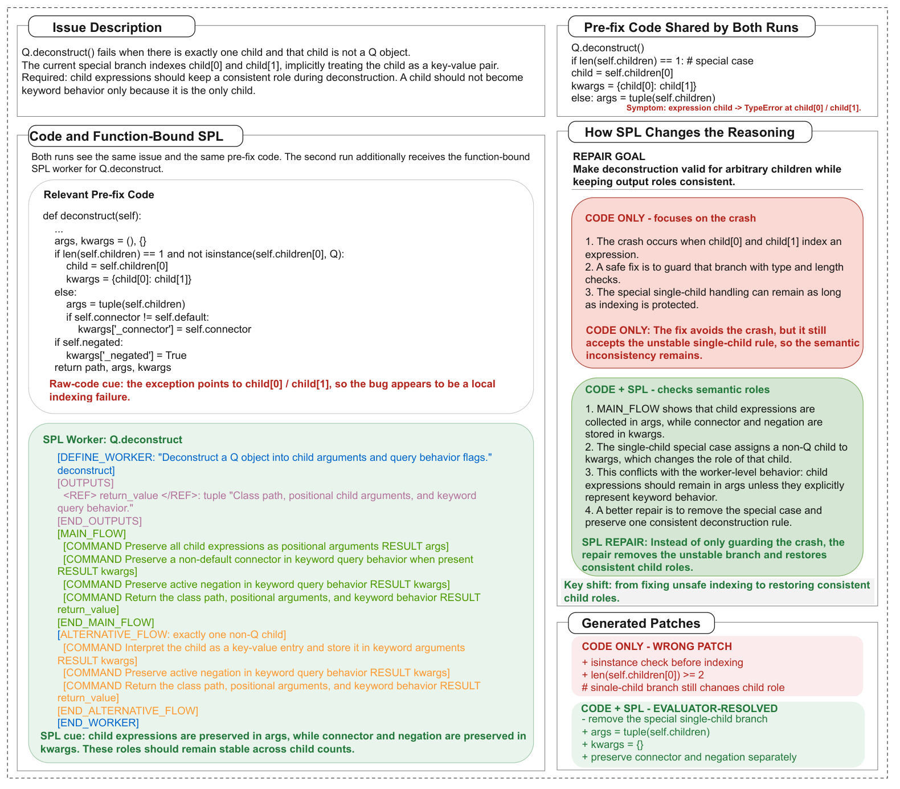
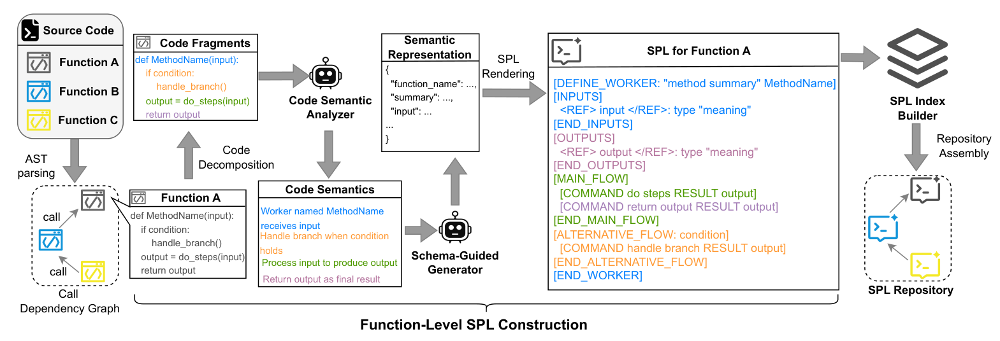
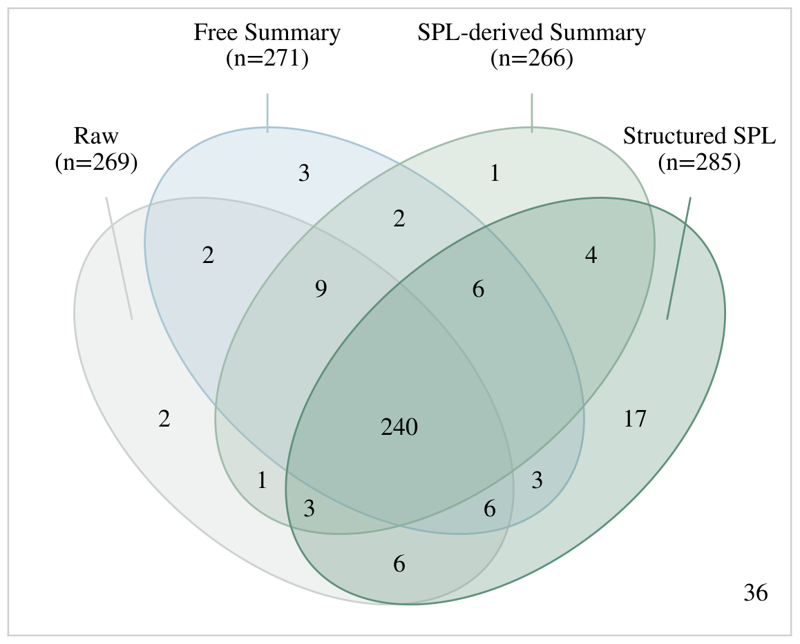
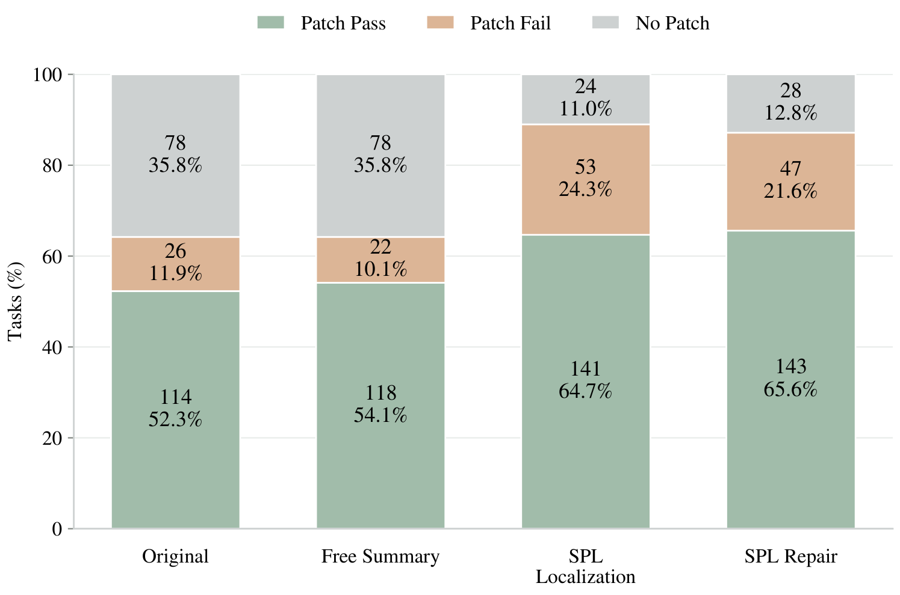

# Beyond Code Summaries: Structured Program Semantics for Reverse Engineering

Hand a coding agent a bug report and a repository, and the patch is rarely the
hard part. The hard part is knowing **where the behavior in question lives**
and **what else must not change** once you touch it. On a large repo, that is
where the budget goes — and where things go wrong.

This package is the replication kit for the anonymous submission that answers
that problem with **SPL (Structured Prompt Language)**: semantics recovered
from source code and stored as structured natural-language prompts — built
once per repository, read on every task against it.

The supplementary material accompanying the paper is available as
[`Code2SPL_Appendix.pdf`](Code2SPL_Appendix.pdf) in the repository root.
It provides the additional experimental details, supplementary analyses,
statistical results, representation controls, resource accounting, and case
evidence referenced throughout the paper and this replication package.

<p align="center">
  
</p>

*Paper Fig. 1 — the same repair task, twice. Code Only guards the unsafe
indexing it found; Code + SPL, holding the function-bound worker, removes the
special case outright and keeps the query flags intact. The SPL worker
describes pre-fix semantics — the issue demands consistent child roles.*


## The idea in one example

Retrieval hands the model a lexical neighborhood; a prose summary reads nicely
but blurs exactly where precision matters. SPL instead says what the code
*does*, tag by tag, anchored to named constructs:

```text
[DEFINE_WORKER: "Determines whether a request should be allowed ..."  filter]
    [INPUTS]   <REF> request </REF>: dictionary "HTTP request with path/method."
    [OUTPUTS]  <REF> result </REF>: boolean "True if the filter passes."
    [MAIN_FLOW]
        [COMMAND Extract 'path' from request  RESULT request_uri]
        [COMMAND If request_uri has the special prefix, return True  RESULT True]
```

Every claim is addressable, every claim names its source construct — so an
agent can jump to the edit site instead of searching for it. And because SPL
describes what the code *does*, never what to change, it never leaks the
answer into the patch.

<p align="center">
  
</p>

*Paper Fig. 2 — how that SPL comes to be: AST parsing recovers functions and
call dependencies, code decomposition feeds a semantic analyzer, a
schema-guided generator organizes the result, and rendering plus indexing
assemble the repository — no task in sight, because construction never sees
the task.*


## Does it work?

| Benchmark | Baseline | With SPL | The catch |
| --- | --- | --- | --- |
| ClassEval reconstruction (RQ1) | — | **+18.8 to +64.6 pp** strict pass | all 20 comparisons survive Holm correction |
| Core reasoning, 341 tasks (RQ2) | 269/341 raw code | **285/341** | strip the tags, same content → 266/341 |
| SWE-bench Lite, 218 tasks (RQ3) | 114/218 base agent | **141/218** | at ~half the tokens and cost (41.3M / $26.94 vs 76.4M / $49.60) |

The catch is the finding: the *structure* is doing real work, not just the
words. A maximal prose description (the full-semantic control) lands at
100/218 on 132M tokens — describing more is not the mechanism. Every number
above is a cell in [`data/results_tables/`](data/results_tables/).

<p align="center">
  
</p>

*Paper Fig. 4 — RQ2 overlap of strictly correct instances. Structured SPL
solves 285 where raw code solves 269 — and 17 of them no other representation
touches, while 36 tasks defeat all four.*

<p align="center">
  
</p>

*Paper Fig. 5 — RQ3 patch lifecycles over the same 218 tasks. The big move is
the right-hand segment: No Patch shrinks from 78 under the base agent to 24
with SPL localization. Passing follows.*

## What's in the box

```text
code/
  RQ1/  RQ2/  RQ3/        one harness per experiment: prepare → run → evaluate
  spl_generation/          the SPL builder — router, symbol index, MCP tools
  common/                  env, paths, providers, the SPL protocol binding
  third_party/             mini-swe-agent, vendored verbatim
  REPRODUCING.md           what to run, in what order, at what cost  ← start here
  PROMPTS.md               every prompt, and where its template lives
docs/
  figures/                 the paper's figures, as PNG for this README
data/
  results_tables/          headline tables as CSV                  ← the numbers
  results/                 per-run records: usage, cost, metrics, statistics
  raw_results/             per-instance trajectories, patches, evaluations
  RQ1/ RQ2/ RQ3/           sample manifests, run configs, frozen SPL artifacts
  PROVENANCE.md            where the data came from, checksums, normalisations
```

`code/RQn` and `data/RQn` share a name per experiment; finished runs keep the
experiment's own name (`exp1_classeval`, `exp2_core`, `exp3_swebench`), because
those are the names the paper's tables use.

## Finding the paper's tables

| Paper table | File |
| --- | --- |
| Table 1 — RQ1 reconstruction | `data/results_tables/table1_rq1_classeval_main.csv` |
| Table 2 — RQ2 core reasoning | `data/results_tables/table2_rq2_core_main.csv` |
| Table 3 — RQ3 repair | `data/results_tables/table3_rq3_swebench_main.csv` |
| Appendix C.1 — structure ablation | `data/results_tables/tableC1_rq1_structure_ablation.csv` |
| Appendix C.2 — method-level rates | `evaluation.json` under `data/raw_results/exp1_classeval/model_runs/<model>/full100/` |
| Appendix C.3 — API fidelity audit | `data/results/exp1_classeval/supplements/api_fidelity/` |
| Appendix D — settings, paired tests | `data/RQn/settings/`, `exp1_classeval_significance.csv`, `enhanced_statistics.json` / `final_analysis*.json` |
| Appendix E, F — repair supplements, 80-step study | per-arm records under `data/results/exp3_swebench/` (`budget80_summary.json`, …) |
| Appendix G — resource accounting | `usage_summary.json` / `cost_summary.json` / `stage_usage_summary.json` beside each run |
| Appendix H — representation controls | untagged / unstructured runs under `data/results/exp2_core/`, `data/results/exp3_swebench/` |
| Appendix I — case evidence | per-instance trajectories under `data/raw_results/` |

Figures draw on the same records, and `data/KEY_CHECKSUMS.csv` checksums every
file the headline numbers rest on.

## The experiments, briefly

| RQ | Asks | Where | Arms |
| --- | --- | --- | --- |
| 1 | Can a model reconstruct a class from SPL alone? | ClassEval, 100 tasks | 5 models × 4 conditions (`free_summary`, `skeleton_holistic`, `spl_only`, `skeleton_spl`) + tag-stripped ablation |
| 2 | Does structured SPL hold up on static reasoning? | 341 multi-function samples | `official_raw`, `raw_free_summary`, tagged SPL, untagged SPL + 52-sample rule-verification subset |
| 3 | Does it survive a real agent on real repos? | SWE-bench Lite, 218 instances | original / free summary / SPL localization / SPL repair / SPL both — plus budget-aligned, untagged, 80-step and full-semantic controls |

Each control arm pins down one alternative explanation: the budget-aligned
re-run rules out an unlucky step cap, the untagged arm isolates structure from
content, the 80-step study tests whether the effect survives a much larger
budget.


## Getting started

Reproduction comes in three levels, with very different costs:

| Level | What it means | Cost |
| --- | --- | --- |
| Read the results | recompute every table from the frozen run records | seconds, no API |
| Re-score | re-run evaluation over the shipped patches | CPU only (RQ3 additionally needs Docker) |
| Re-run | generate new outputs from the models | API calls at full experiment cost |

### Install

Python 3.11 or newer; every command runs from the package root (the directory
holding `code/`, `data/`, `requirements.txt`):

```bash
python -m pip install -r requirements.txt
```

`requirements.txt` is the whole environment; it installs `mini-swe-agent` from
the unmodified copy vendored under `code/third_party/`, so the agent version
is the one shipped here.

### Configure the LLM environment

All model access goes through OpenAI-compatible endpoints, configured in one
file:

```bash
cp code/.env.example code/.env
```

Then edit `code/.env`. The entries that matter:

| Entry | What it is |
| --- | --- |
| `OPENAI_API_KEY` | the key every stage authenticates with (required) |
| `OPENAI_API_KEYS` | several keys for parallel runs; requests are spread across them |
| `OPENAI_BASE_URL` | your OpenAI-compatible gateway, if you use one; leave blank for the OpenAI default |
| `SPL_BASE_URL` / `SPL_API_KEY` | a separate endpoint for SPL-building calls, if the builder runs elsewhere |
| `SPL_BUILDER_MODEL` | which model builds SPL (the reported artifacts used `deepseek-v4-flash`) |
| `SPL_TASK_MODEL` | the model for the measured stage of a *new* run |

Two rules about what overrides what:

- **The environment supplies access; the configs supply behavior.** Which
  model, temperature and token cap a run uses is recorded in the JSON configs
  under `data/RQn/settings/` — the harness reads those from the config, never
  from `.env`. To substitute a different model, edit the config; `.env.example`
  §5 lists every config file and the exact settings it records.
- **A config's own `base_url` beats `.env`.** The DeepSeek configs name
  `https://api.deepseek.com` themselves; the Claude/GPT configs ship with
  `"base_url": null` and take the endpoint from `OPENAI_BASE_URL`.

No credential is stored anywhere in the package, and `.gitignore` excludes
`.env`. Any entry can also be given as a plain environment variable, which
wins over the file.

### Generate SPL for a repository

SPL construction lives in [`code/spl_generation/`](code/spl_generation/) —
`spl_router/` turns a repository into SPL, `spl_core/` renders the workers and
cards, `spl_index/` keeps the symbol index, and `spl_mcp/` exposes the tool
family the RQ3 agent calls (`spl_understand`, `spl_search`, `spl_expand`,
`spl_refresh`, …). The experiments reach it through each experiment's prepare
stage:

| Experiment | SPL built by | Where the artifacts land |
| --- | --- | --- |
| RQ1 ClassEval | the model under test, in `code/RQ1/prepare.py` + `run.py` | `data/RQ1/spl_assets/model_runs/<model>/` |
| RQ2 CoRe | `code/RQ2/prepare.py` (+ `repair_spl.py` for gaps) | `data/RQ2/spl_assets/` |
| RQ3 SWE-bench | `code/RQ3/prepare_random218_flash_assets.py`, builder `deepseek-v4-flash` | `data/RQ3/spl_assets/` |

**One warning before building anything:** the artifacts under `data/*/spl_assets/`
are *frozen* — every number in the paper was measured against exactly these
files, and model sampling is not deterministic, so regenerating them changes
the text and voids the comparison. Reproduce by reading them; extend
`code/spl_generation/` only to cover new repositories, with the builder
settings (`SPL_BUILDER_*`) in `.env`.

### Rebuild the paper tables

No key, no network, seconds:

```bash
python code/tools/build_tables.py
```

A clean run ends with `cross-checked 6 frozen rows, 0 mismatch(es)` — that is
the package proving it arrived intact. To verify the evidence files too:

```bash
python code/tools/build_key_checksums.py   # rewrites data/KEY_CHECKSUMS.csv; diff against the shipped copy
```

### Re-run an experiment

Every experiment is driven the same way — a JSON config through three stages:

```bash
python code/RQ1/prepare.py  --config data/RQ1/settings/configs/full100_deepseek-v4-pro.json
python code/RQ1/run.py      --config data/RQ1/settings/configs/full100_deepseek-v4-pro.json
python code/RQ1/evaluate.py --config data/RQ1/settings/configs/full100_deepseek-v4-pro.json
```

RQ2 is identical with its `full341_*.json` configs. RQ3 wraps the stages in
scripts (`code/RQ3/scripts/run_random218.py`, `eval_random218.py`,
`analyze_random218_results.py`) and additionally needs Docker (each patch is
evaluated inside the instance's official image) and, on Windows, long-path
support (`git config --system core.longpaths true`).

The upstream datasets (ClassEval, CoRe) are not shipped;
[`data/PROVENANCE.md`](data/PROVENANCE.md) gives the mirrors, expected paths
and checksums — reading or recomputing the results needs none of them.
Re-running costs real tokens (the smallest RQ3 arm is 41.3M);
[`code/REPRODUCING.md`](code/REPRODUCING.md) maps every level entry point by
entry point, including the supplementary arms.

## Support

This package accompanies a double-anonymous submission and carries no author
identifiers. Questions raised through the review process will be answered
there; issues are welcome on the public repository once the paper is no longer
anonymous.
